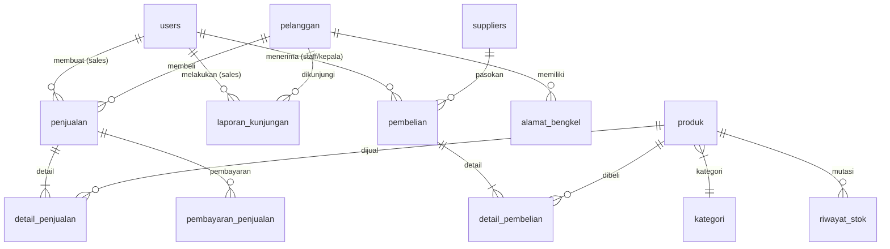
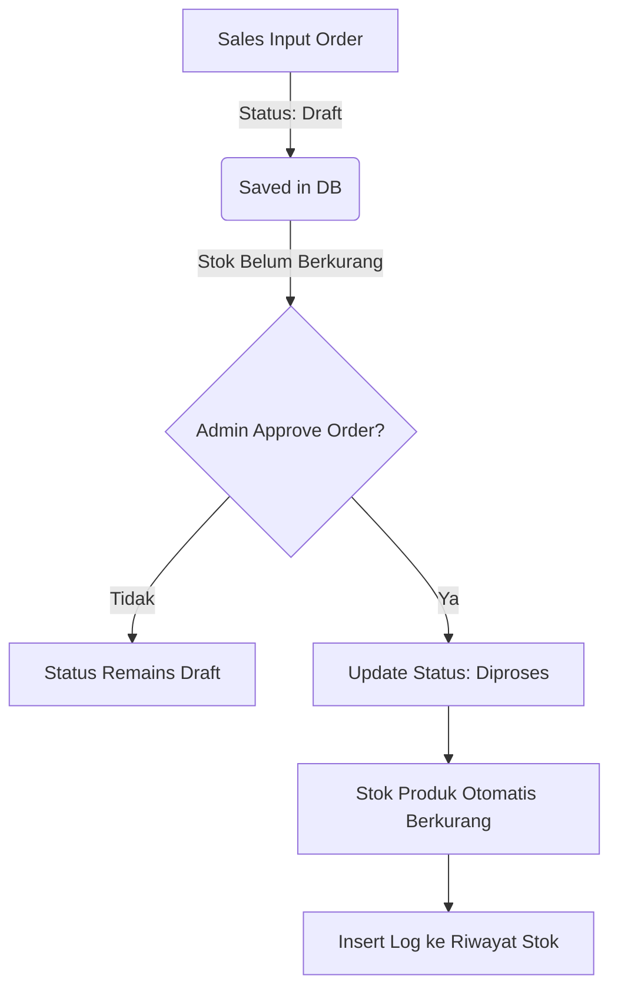
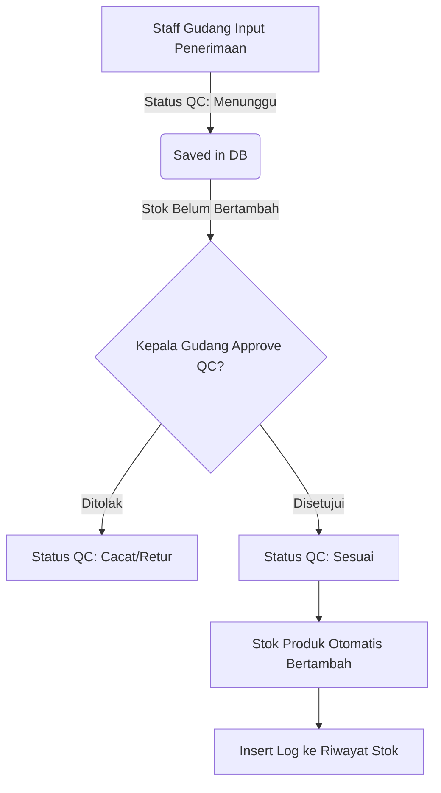

# 📚 DOKUMENTASI COMPREHENSIVE BACKEND API SYSTEM
### PT. GRACIA ANUGERAH NUSA ABADI (GANA ERP)

Dokumentasi ini adalah **panduan lengkap & komprehensif** untuk arsitektur Backend REST API **GANA ERP System**. Dokumentasi ini disusun secara profesional, terperinci, dan sangat mudah dipahami bagi pengembang pemula maupun senior.

> [!NOTE]
> Backend ini menggunakan arsitektur **Direct Controller-to-Database Execution** berbasis Node.js & MySQL tanpa ORM rumit, sehingga alur query transparan, cepat, dan sangat mudah dipelajari.

---

## 📋 DAFTAR ISI
1. [⚡ Quick Start & Instalasi](#-1-quick-start--instalasi)
2. [🚀 2. Arsitektur & Spesifikasi Teknologi](#-2-arsitektur--spesifikasi-teknologi)
3. [📁 3. Struktur Direktori Backend (`backend-gana/`)](#-3-struktur-direktori-backend-backend-gana)
4. [🛠️ 4. Konfigurasi Environment (`.env`)](#%EF%B8%8F-4-konfigurasi-environment-env)
5. [🗄️ 5. Skema Relasi Database MySQL (`gana_db`)](#%EF%B8%8F-5-skema-relasi-database-mysql-gana_db)
6. [📖 6. Penjelasan 12 Controller Utama & Logika Bisnis](#-6-penjelasan-12-controller-utama--logika-bisnis)
7. [🔄 7. Diagram Alur Transaksi Utama (Flowcharts)](#-7-diagram-alur-transaksi-utama-flowcharts)
8. [📌 8. REST API Reference & Contoh Payload JSON](#-8-rest-api-reference--contoh-payload-json)
9. [🛡️ 9. Keamanan & System Middleware](#%EF%B8%8F-9-keamanan--system-middleware)
10. [🔧 10. Panduan Troubleshooting & FAQ Pemula Lengkap (30 Q&A)](#-10-panduan-troubleshooting--faq-pemula-lengkap-30-qa)

---

## ⚡ 1. Quick Start & Instalasi

### Prasyarat System:
* **Node.js**: v18.0.0 atau yang lebih baru
* **Database**: MySQL 5.7+ / MariaDB 10.4+ (XAMPP / Laragon / Standalone)
* **Package Manager**: npm (v9+)

### Langkah Menjalankan Backend:
```bash
# 1. Masuk ke direktori backend
cd backend-gana

# 2. Install dependensi package (jika pertama kali)
npm install

# 3. Pastikan MySQL sudah aktif & database 'gana_db' terhubung

# 4. Jalankan server backend versi development
npm run dev
```

> Server API akan aktif dan siap menerima request di **`http://localhost:5000`**.

---

## 🚀 2. Arsitektur & Spesifikasi Teknologi

| Komponen | Teknologi | Spesifikasi / Deskripsi |
| :--- | :--- | :--- |
| **Runtime** | Node.js | Lingkungan eksekusi JavaScript Server-Side |
| **Framework** | Express.js | Framework HTTP server & REST API routing |
| **Database Driver** | `mysql2/promise` | Driver MySQL native dengan Connection Pool & Promises |
| **Authentication** | JSON Web Token (JWT) | Otentikasi token stateless dengan durasi 8 Jam |
| **Password Hashing**| Bcrypt.js | Enkripsi hashing password 10 salt rounds |
| **Pattern Architecture**| Direct Controller | Query SQL dieksekusi langsung di Controller tanpa ORM |

---

## 📁 3. Struktur Direktori Backend (`backend-gana/`)

```text
backend-gana/
├── config/
│   └── db.js                 # Pool Koneksi Database MySQL (mysql2)
├── controllers/              # Logika Bisnis & Query SQL Langsung (12 File)
│   ├── alamatController.js           # Management Alamat Bengkel Mitra
│   ├── authController.js             # Autentikasi Login & Pembuatan JWT
│   ├── dashboardController.js        # Dashboard Admin/Owner, Piutang & Aging
│   ├── kategoriController.js         # Master Kategori Pelumas
│   ├── kunjunganController.js        # Laporan Visit Sales & Foto Lokasi
│   ├── pelangganController.js        # Master Bengkel & Alamat Utama
│   ├── pembelianController.js        # Barang Masuk Supplier & Approval QC
│   ├── penjualanController.js        # Sales Order, Potong Stok & Piutang
│   ├── produkController.js           # Katalog Produk, SAE, Brand & HET
│   ├── stokController.js             # Audit Mutasi Stok & Saldo Berjalan
│   ├── supplierController.js         # Master Supplier Barang
│   ├── targetPenjualanController.js # Target Omset & Performa Sales
│   └── userController.js             # Management User & Hak Akses (RBAC)
├── middlewares/              # Keamanan & Handling Sesi
│   ├── authMiddleware.js     # Verifikasi Token JWT & Otorisasi Role
│   └── errorMiddleware.js    # Global Express Error Handler
├── routes/                   # Routing Endpoint REST API (14 File)
│   ├── adminDashboardRoutes.js
│   ├── alamatRoutes.js
│   ├── authRoutes.js
│   ├── kategoriRoutes.js
│   ├── kunjunganRoutes.js
│   ├── ownerDashboardRoutes.js
│   ├── pelangganRoutes.js
│   ├── pembelianRoutes.js
│   ├── penjualanRoutes.js
│   ├── produkRoutes.js
│   ├── stokRoutes.js
│   ├── supplierRoutes.js
│   ├── targetPenjualanRoutes.js
│   └── userRoutes.js
├── utils/
│   └── asyncHandler.js       # Helper Async Error Wrapper
├── .env                      # Variabel Konfigurasi Lingkungan
├── package.json              # Script & Package Dependencies
└── server.js                 # Entry Point Utama Express Server
```

---

## 🛠️ 4. Konfigurasi Environment (`.env`)

File `.env` terletak di akar proyek `backend-gana/`:

```env
PORT=5000
DB_HOST=localhost
DB_USER=root
DB_PASSWORD=
DB_NAME=gana_db
JWT_SECRET=gana_secret_key_2026
```

---

## 🗄️ 5. Skema Relasi Database MySQL (`gana_db`)

Sistem menggunakan database relasional MySQL **`gana_db`** dengan skema tabel utama sebagai berikut:



---

## 📖 6. Penjelasan 12 Controller Utama & Logika Bisnis

### 🔑 1. `authController.js` — Autentikasi Login & Sesi
* **Tugas**: Otentikasi username & password pengguna saat login.
* **Proses**:
  1. Mengambil data user berdasarkan `username` dari database.
  2. Verifikasi hash password menggunakan `bcrypt.compare()`.
  3. Memproduksi digital token **JWT** berisi `id`, `username`, `role`, dan `nama`.

### 👤 2. `userController.js` — Management User (RBAC)
* **Tugas**: Mengelola pengguna sistem (`admin`, `sales`, `owner`, `kepala_gudang`, `staff_gudang`).
* **Fitur**: Pengubahan status (`Aktif`/`Tidak Aktif`) dan pembersihan akun pengguna.

### 🏪 3. `pelangganController.js` — Master Bengkel Mitra
* **Tugas**: CRUD data bengkel mitra langganan.
* **Transaksi**: Menggunakan `db.getConnection()` dengan `beginTransaction()` untuk menyimpan profil bengkel & alamat utama secara atomic.

### 🛢️ 4. `produkController.js` — Katalog Produk & Oli
* **Tugas**: Pengelolaan katalog pelumas (Brand, SAE, Kemasan, Grade, HET, dan Stok Karton).
* **Auto-Brand**: Helper `formatBrand()` memastikan nama brand tersimpan rapi.

### 📦 5. `penjualanController.js` — Sales Order, Otomatisasi Stok & Piutang
* **Tugas**: Memproses transaksi penjualan dari Sales Team hingga pelunasan piutang.
* **Aturan Stok Otomatis**:
  * Status **`Draft`**: Stok produk **belum** dipotong.
  * Status **`Diproses`** (Disetujui Admin): Stok produk **otomatis berkurang** dan dicatat di `riwayat_stok`.
* **Pelunasan Piutang**: Memverifikasi cicilan di `pembayaran_penjualan`. Jika total pembayaran disetujui $\ge$ total netto, `status_bayar` pada `penjualan` otomatis berubah menjadi **`Lunas`**.

### 🚛 6. `pembelianController.js` — Barang Masuk & Quality Control (QC)
* **Tugas**: Penerimaan barang supplier dari Staff Gudang.
* **Aturan Stok Otomatis**:
  * Status **`Menunggu`**: Stok produk **belum** bertambah.
  * Status **`Sesuai`** (Disetujui Kepala Gudang): Stok produk **otomatis bertambah** dan dicatat di `riwayat_stok`.

### 📍 7. `kunjunganController.js` — Laporan Kunjungan Sales
* **Tugas**: Mencatat visit Sales ke bengkel mitra beserta bukti foto lokasi & catatan diskusi.

### 📊 8. `stokController.js` — Audit Mutasi Stok
* **Tugas**: Menghitung saldo berjalan (*running balance*) persediaan stok barang masuk & keluar per produk secara kronologis.

### 📈 9. `dashboardController.js` — Metrik Dashboard, Piutang & Aging
* **Fungsi Utama**:
  * **Admin Dashboard**: Omset bulanan, sales aktif, produk aktif, transaksi terbaru.
  * **Owner Dashboard**: Grafik MTD penjualan vs pembelian, top 5 piutang terbesar.
  * **Monitoring Piutang**: Total piutang berjalan, tagihan jatuh tempo (*Overdue*), dan peringatan (< 7 hari).
  * **Aging Schedule**: Analisis piutang kritis (>45 hari) per bengkel.
  * **Laporan Penjualan**: Laporan omset, volume karton, top customer, dan breakdown brand.

### 🎯 10. `targetPenjualanController.js` — Target Bulanan Sales
* **Tugas**: Mengatur target omset, volume karton, dan produk fokus bulanan per Sales Team serta menghitung pencapaian real-time.

### 🏷️ 11. `kategoriController.js` | 🏭 12. `supplierController.js` | 🏠 `alamatController.js`
* **Tugas**: Pengelolaan data master referensi (Kategori pelumas, Supplier, dan Alamat Bengkel).

---

## 🔄 7. Diagram Alur Transaksi Utama (Flowcharts)

### A. Alur Sales Order & Pemotongan Stok


### B. Alur Barang Masuk & Penambahan Stok


---

## 📌 8. REST API Reference & Contoh Payload JSON

### 1. Authentication (`/api/auth`)
#### `POST /api/auth/login`
* **Request Body**:
```json
{
  "username": "admin1",
  "password": "password123"
}
```
* **Response 200 OK**:
```json
{
  "success": true,
  "message": "Login Berhasil.",
  "token": "eyJhbGciOiJIUzI1NiIsInR5cCI6IkpXVCJ9...",
  "data": {
    "id": 1,
    "username": "admin1",
    "role": "admin",
    "nama": "king yuan"
  }
}
```

### 2. User Management (`/api/users`)
#### `POST /api/users` (Tambah User)
* **Headers**: `Authorization: Bearer <TOKEN>`
* **Request Body**:
```json
{
  "username": "sales_baru",
  "password": "password123",
  "nama": "Sales Budi",
  "role": "sales",
  "no_hp": "081234567890",
  "status": "Active"
}
```

### 3. Penjualan / Sales Order (`/api/penjualan`)
#### `POST /api/penjualan` (Buat Order Baru)
* **Headers**: `Authorization: Bearer <TOKEN>`
* **Request Body**:
```json
{
  "id_pelanggan": 1,
  "id_sales": 101,
  "metode_bayar": "Tempo",
  "status_bayar": "Belum Lunas",
  "status_pengiriman": "Draft",
  "total_netto": 600000,
  "dataDetail": [
    {
      "id_produk": 1,
      "qty_beli": 4,
      "qty_dus": 4,
      "subtotal": 600000
    }
  ]
}
```

---

## 🛡️ 9. Keamanan & System Middleware

### 1. `authMiddleware.js`
* Memeriksa keberadaan header `Authorization: Bearer <TOKEN>`.
* Mengamankan route dengan enkripsi JWT.
* Memverifikasi hak akses pengguna berdasarkan role (RBAC):
  ```javascript
  const authorizeRoles = (...roles) => {
    return (req, res, next) => {
      if (!roles.includes(req.user.role)) {
        return res.status(403).json({ success: false, message: "Akses ditolak." });
      }
      next();
    };
  };
  ```

### 2. `asyncHandler.js`
* Helper pembungkus `try-catch` otomatis pada fungsi async Express controller sehingga kode lebih bersih dan terhindar dari pengulangan `try-catch`.

---

## 🔧 10. Panduan Troubleshooting & FAQ Pemula Lengkap (30 Q&A)

### Q1: Kenapa timbul error `401 Unauthorized`?
* **Penyebab**: Sesi token JWT telah kadaluwarsa (berlaku 8 jam) atau Header `Authorization` belum dikirimkan pada HTTP request.
* **Solusi**: Lakukan login ulang melalui `/api/auth/login`, lalu sertakan header `Authorization: Bearer <TOKEN_JWT_BARU>` pada setiap HTTP Request berikutnya.

### Q2: Kenapa timbul error `ER_NO_REFERENCED_ROW_2` (Foreign Key Constraint Fail)?
* **Penyebab**: ID relasi yang dikirimkan pada request (misalnya `id_pelanggan`, `id_produk`, `id_sales`, atau `id_supplier`) tidak ditemukan pada database.
* **Solusi**: Pastikan data induk (Master Data) sudah terdaftar terlebih dahulu sebelum membuat transaksi Penjualan, Pembelian, atau Kunjungan.

### Q3: Bagaimana cara mengubah port server backend jika Port 5000 terpakai?
* **Solusi**: Buka file `.env` di folder `backend-gana`, ubah `PORT=5000` menjadi port lain yang kosong (contoh `PORT=5001`), lalu jalankan ulang `npm run dev`.

### Q4: Mengapa stok produk tidak otomatis berkurang saat Sales Order baru diinput oleh Sales?
* **Penjelasan Bisnis**: Ketika Sales membuat order, pesanan berstatus **`Draft`** (Stok belum berkurang agar stok tidak terkunci jika order batal).
* **Solusi**: Stok baru akan **otomatis berkurang** secara teratur saat Admin menyetujui pesanan tersebut (Mengubah status dari `Draft` menjadi `Diproses` / `Approved`).

### Q5: Apakah hasil inspeksi QC barang masuk bisa ditolak oleh Kepala Gudang, dan apa dampaknya ke stok?
* **Penjelasan Bisnis & Aplikasi**: 
  * **BISA DITOLAK**. Saat Staff Gudang menginput barang masuk supplier, status awal berstatus QC **`Menunggu`**.
  * **Jika Disetujui (`Sesuai`)**: Kepala Gudang mengeklik **Approve QC**, status berubah menjadi `Sesuai`, dan **stok produk otomatis bertambah** di gudang & terisi di `riwayat_stok`.
  * **Jika Ditolak (`Cacat/Retur`)**: Kepala Gudang mengeklik **Tolak QC**, status berubah menjadi `Cacat/Retur`. **Stok TIDAK akan bertambah** ke inventaris untuk mencegah produk rusak/cacat tercatat sebagai barang siap jual.

### Q6: Bagaimana cara mengatasi error CORS (`Access-Control-Allow-Origin`) saat dipanggil dari Frontend?
* **Penyebab**: Domain/port Frontend (`localhost:5173`) diblokir oleh kebijakan keamanan browser.
* **Solusi**: Pastikan middleware `cors()` telah terpasang di file `server.js`:
  ```javascript
  const cors = require('cors');
  app.use(cors());
  ```

### Q7: Mengapa password user yang dibuat baru tidak bisa digunakan untuk login?
* **Penyebab**: Password tersimpan sebagai teks biasa (*plain text*) tanpa di-hash oleh Bcrypt.
* **Solusi**: Pastikan pembuatan user baru di `userController.js` menggunakan fungsi hashing:
  ```javascript
  const hashedPassword = await bcrypt.hash(rawPass, 10);
  ```

### Q8: Bagaimana cara kerja status pelunasan piutang otomatis (`Lunas` vs `Belum Lunas`)?
* **Logika Sistem**: Setiap cicilan pembayaran yang diinput di `pembayaran_penjualan` diverifikasi dengan `status_pembayaran = 'Disetujui'`. Backend menghitung total cicilan yang disetujui (`SUM(jumlah_bayar)`). Jika `Total Approved >= total_netto` invoice, `status_bayar` pada tabel `penjualan` otomatis diupdate menjadi **`Lunas`**.

### Q9: Apa perbedaan antara status "Tidak Aktif" dan "Hapus Permanen" pada User Management?
* **Status "Tidak Aktif"**: Pengguna tidak dapat login ke sistem, namun **data transaksi terdahulu tetap utuh & tersimpan rapi** di database.
* **Hapus Permanen**: Baris akun dihapus permanen dari MySQL. Jika user memiliki riwayat transaksi, sistem akan otomatis mengamankan riwayat finansial lewat soft-delete.

### Q10: Mengapa gambar foto kunjungan sales atau bukti bayar tidak muncul (Error 404)?
* **Penyebab**: Folder penyimpanan statis belum didaftarkan di Express server.
* **Solusi**: Pastikan folder static `uploads` terhubung di `server.js`:
  ```javascript
  app.use('/uploads', express.static(path.join(__dirname, 'uploads')));
  ```

### Q11: Bagaimana cara melakukan backup & restore database MySQL `gana_db`?
* **Backup (Export)**: `mysqldump -u root -p gana_db > backup_gana_db.sql`
* **Restore (Import)**: `mysql -u root -p gana_db < backup_gana_db.sql`

### Q12: Bagaimana cara menambah role / tingkat hak akses pengguna baru di backend?
* **Solusi**: Daftarkan otorisasi role baru pada file `middlewares/authMiddleware.js`:
  ```javascript
  router.use(authorizeRoles('admin', 'role_baru'));
  ```

### Q13: Mengapa kartu Monitoring Piutang & Aging Schedule bernilai `Rp 0`?
* **Penyebab**: Tanggal jatuh tempo (`tgl_jatuh_tempo`) belum terisi atau status tempo belum terpetakan.
* **Solusi**: Sistem otomatis menghitung `diffDays` berdasarkan tanggal hari ini (`today`). Jika `tgl_jatuh_tempo` telah terisi dan telah melewati tanggal hari ini, nominal piutang otomatis masuk ke agregasi **Overdue** / **Aging Schedule >45 Hari**.

### Q14: Bagaimana cara mereset password pengguna yang lupa kata sandi?
* **Solusi**: Admin dapat melakukan update password via endpoint `/api/users/:id` dengan mengirimkan field `password` baru. Controller akan otomatis men-encrypt password baru dengan Bcrypt.

### Q15: Bagaimana alur pembatalan Sales Order dan dampaknya pada stok?
* **Logika Restorasi**: Jika Sales Order yang pernah disetujui (`Diproses`/`Dikirim`) dibatalkan oleh Admin, Backend akan **otomatis mengembalikan stok** ke tabel `produk` (`stok_total_karton = stok_total_karton + qty_beli`) dan mencatat mutasi masuk di `riwayat_stok`.

### Q16: Mengapa muncul error `ER_BAD_FIELD_ERROR` saat query MySQL dijalankan?
* **Penyebab**: Nama kolom pada query SQL tidak cocok dengan nama kolom di tabel MySQL.
* **Solusi**: Periksa skema tabel MySQL menggunakan `SHOW COLUMNS FROM nama_tabel;` dan pastikan nama kolom persis sama (perhatikan _underscore_).

### Q17: Bagaimana cara backend menghitung total volume sales dalam satuan Karton/Dus?
* **Logika**: Setiap item detail penjualan menyimpan `qty_beli` (karton/dus) dan `subtotal`. Agregasi total volume karton dihitung lewat `SUM(qty_beli)` dari tabel `detail_penjualan`.

### Q18: Bagaimana cara menangani koneksi database terputus (*Database Connection Lost*)?
* **Solusi**: Backend menggunakan `mysql2/promise` **Connection Pool** (`db.js`) yang secara otomatis menangani *re-connection* dan *idle connection cleanup* tanpa mematikan Express server.

### Q19: Bagaimana cara kerja pencarian (*Search*) data di backend?
* **Logika**: Query SQL memanfaatkan klausul `WHERE column LIKE ?` dengan wildcard `%term%`:
  ```javascript
  const [rows] = await db.query("SELECT * FROM pelanggan WHERE nama_bengkel LIKE ?", [`%${search}%`]);
  ```

### Q20: Mengapa data angka nominal Rupiah di frontend kadang menampilkan desimal gantung?
* **Solusi**: Seluruh fungsi perhitungan harga, total netto, dan piutang di backend di-wrap menggunakan pembulatan presisi `Math.round()` sebelum dikirimkan ke frontend.

### Q21: Bagaimana cara mengamankan Endpoint API publik vs Endpoint terproteksi?
* **Endpoint Publik**: Tidak menggunakan middleware `authMiddleware.verifyToken` (contoh: `/api/auth/login`).
* **Endpoint Terproteksi**: Menggunakan middleware `authMiddleware.verifyToken` (contoh: `/api/penjualan`, `/api/produk`).

### Q22: Apakah backend ini mendukung pencetakan dokumen Invoice, Faktur Pajak, dan Surat Jalan?
* **Ya**. Backend menyediakan data terstruktur lengkap (Header invoice, rincian item, PPN, dan signature) yang digunakan oleh frontend untuk mencetak dokumen siap print.

### Q23: Bagaimana cara meng-upload foto lokasi kunjungan Sales ke server?
* **Solusi**: Menggunakan middleware `multer` yang menyimpan file image ke folder `uploads/kunjungan/` dan mengembalikan URL path relatif file ke database.

### Q24: Bagaimana backend menghitung target omset dan persentase pencapaian Sales Team?
* **Rumus**:
  $$\text{Persentase Pencapaian (\%)} = \left( \frac{\text{Total Omset Sales Bulan Ini}}{\text{Target Omset Bulanan}} \right) \times 100\%$$

### Q25: Mengapa saat server backend di-restart data transaksi tidak hilang?
* **Penjelasan**: Seluruh data tersimpan secara permanen pada disk MySQL Database Engine (`gana_db`). Restart Node.js server hanya memperbarui memori program, bukan menghapus data database.

### Q26: Bagaimana cara membatasi ukuran maksimum file foto upload (misal foto Surat Jalan / Visit Sales)?
* **Solusi**: Konfigurasikan batas `limits` pada `multer`:
  ```javascript
  const upload = multer({ limits: { fileSize: 5 * 1024 * 1024 } }); // Maksimal 5MB
  ```

### Q27: Bagaimana cara menguji seluruh API Endpoint secara otomatis tanpa klik di UI?
* **Solusi**: Jalankan script pengujian integrasi otomatis: `node scratch/test_crud_all.js` yang akan menguji seluruh operasi CRUD dalam hitungan detik.

### Q28: Bagaimana status pengiriman barang pada Surat Jalan diperbarui oleh Staff Gudang?
* **Alur Status**: `Draft` (Sales Order Baru) $\rightarrow$ `Diproses` (Disetujui Admin) $\rightarrow$ `Dikirim` (Surat Jalan Gudang) $\rightarrow$ `Diterima` (Diterima Bengkel Mitra).

### Q29: Bagaimana cara menangani error `PayloadTooLargeError` saat mengirim data dalam jumlah besar?
* **Solusi**: Atur limit JSON body parser pada `server.js`:
  ```javascript
  app.use(express.json({ limit: '10mb' }));
  app.use(express.urlencoded({ limit: '10mb', extended: true }));
  ```

### Q30: Bagaimana cara mendeploy Backend ini ke Server Cloud / VPS Production?
* **Langkah Production**:
  1. Install Node.js, MySQL, dan PM2 Process Manager di VPS (Ubuntu/Debian).
  2. Import database `gana_db.sql` ke MySQL server VPS.
  3. Konfigurasi file `.env` production (Host, DB User, Password, JWT Secret).
  4. Jalankan backend dengan PM2: `pm2 start server.js --name gana-backend`.
  5. Konfigurasi Nginx sebagai Reverse Proxy dan pasang SSL Certificate (HTTPS) dengan Certbot.

---

> [!IMPORTANT]
> Seluruh endpoint yang membutuhkan otentikasi wajib menyertakan Header: `Authorization: Bearer <TOKEN_JWT>`.

*Dokumentasi Resmi Backend PT. Gracia Anugerah Nusa Abadi (GANA ERP).*
